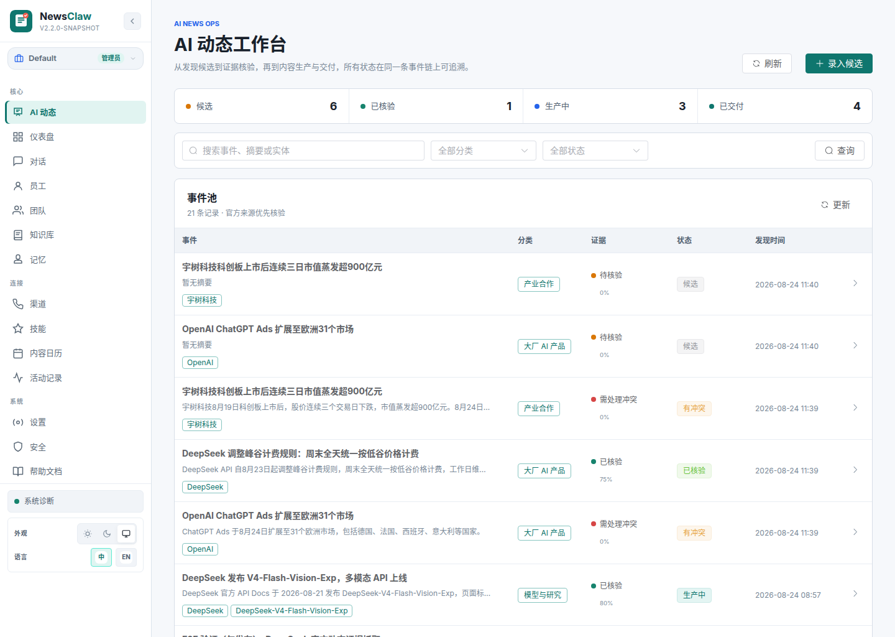
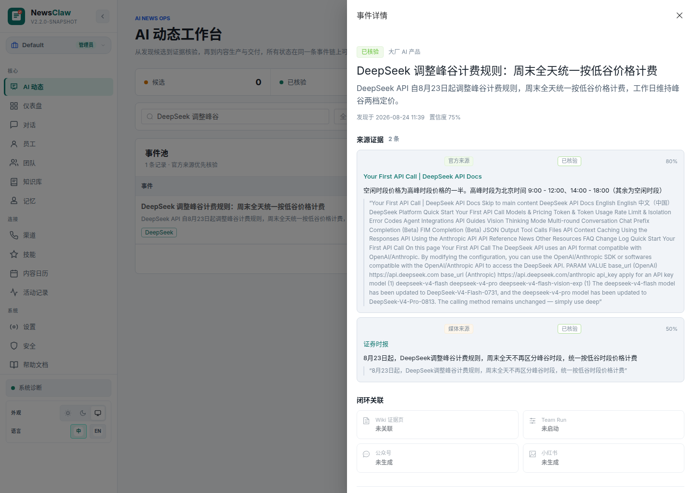
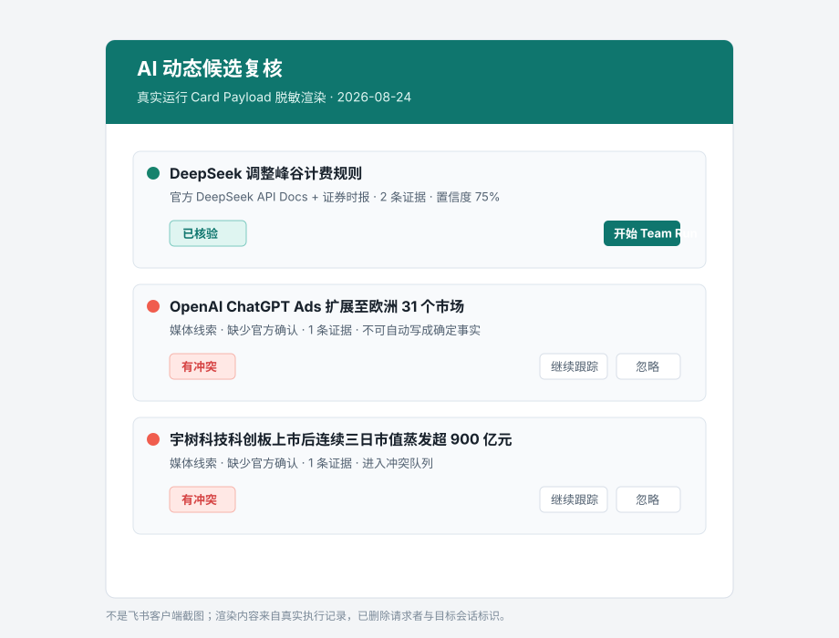
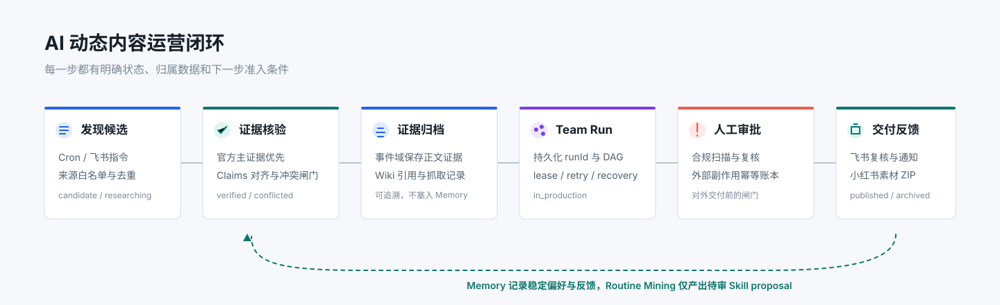
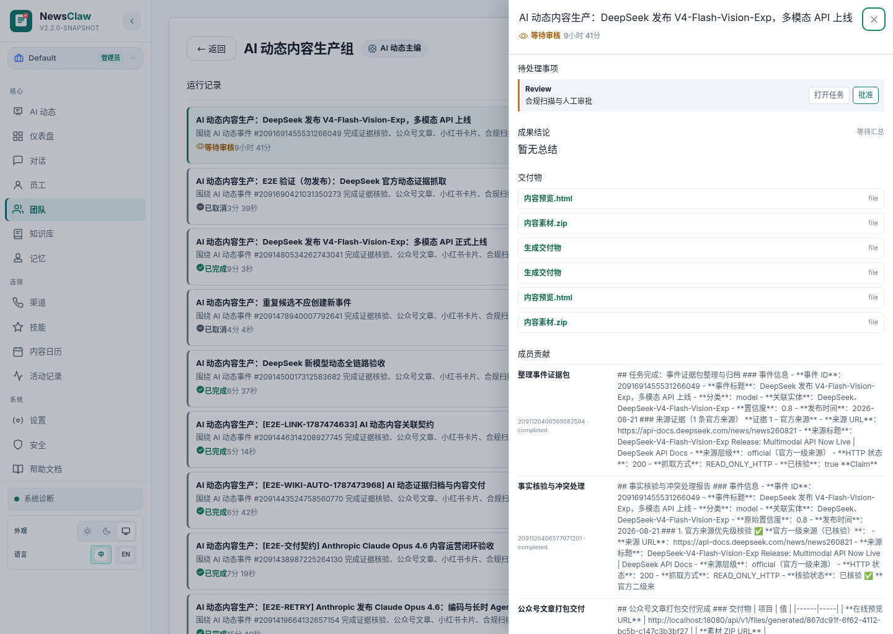
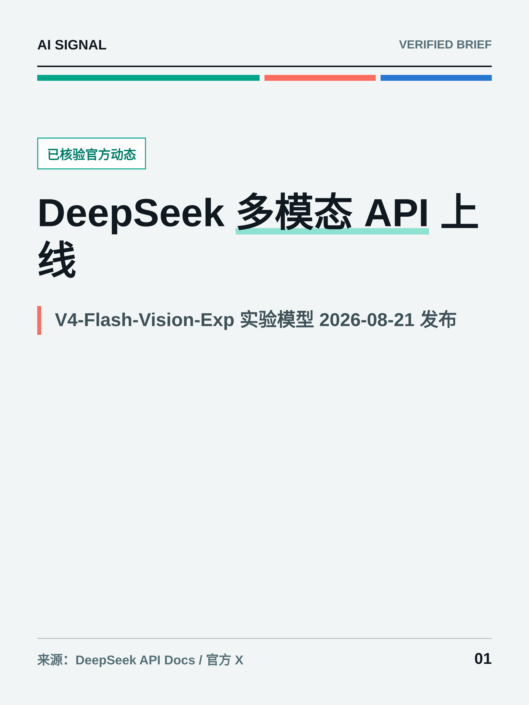
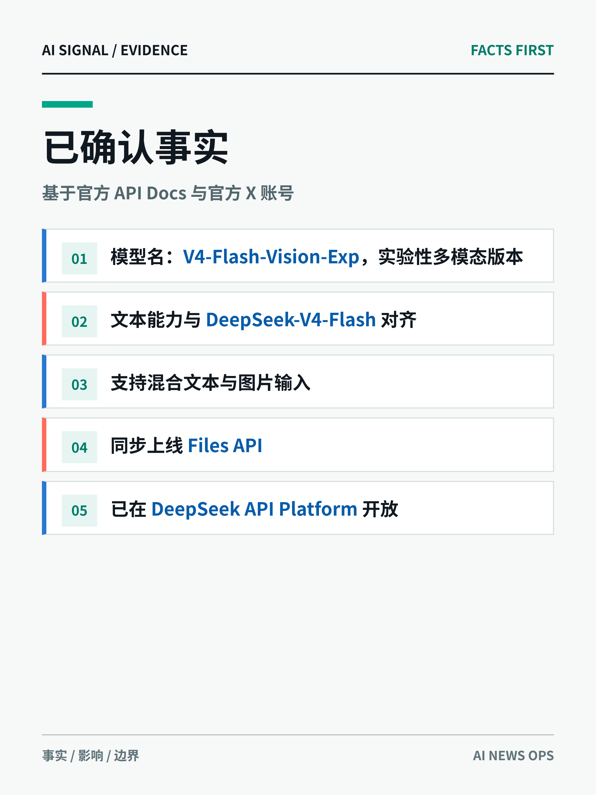
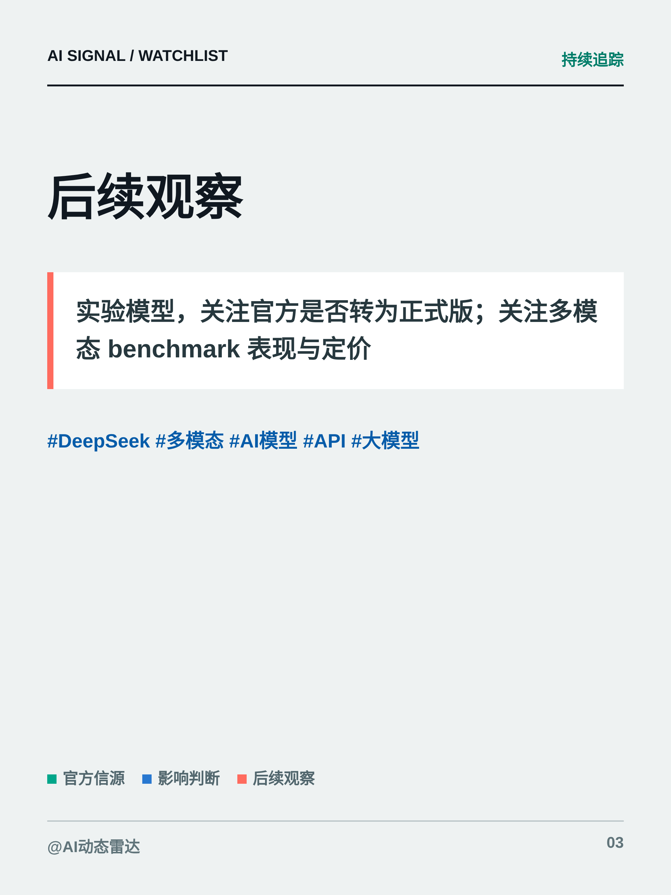

# NewsClaw

<p align="center">
  
</p>

<p align="center"><strong>面向全球与中国 AI 圈的动态发现、证据核验与内容运营 Agent</strong></p>

<p align="center">
  <a href="https://github.com/LittleSongxx/NewsClaw"></a>
  
  
  
  
</p>

<p align="center"><a href="README_en.md">English</a></p>

NewsClaw 不把“搜到新闻”当作终点。它围绕 AI 行业的时效事件，完成从信号发现、事实核验、长任务内容生产到人工审批和多渠道交付的一条可追溯闭环。覆盖基础模型、具身智能与机器人、芯片与基础设施、大厂 AI 产品、开源发布、融资合作和政策动态。

公开作品集入口：构建后访问 `/` 或 `/showcase`。它是脱敏、只读的静态展示，不依赖登录、数据库或模型；后台控制台仍在 `/ai-news`，需要认证。



*真实已登录工作台截图，使用本地已落库的 AI 事件数据。截图中不包含模型 Key、飞书目标 ID、Open ID 或令牌。*

## 一条真实指令如何跑完整闭环

2026-08-24，飞书机器人接收了这条真实请求：

> 请汇总今天 DeepSeek、OpenAI 和宇树科技的最新动态，并把候选事件发成复核卡

该次运行使用 `bailian-team / qwen3.7-plus`，入站时间为 `15:10:28`，完成时间为 `15:11:23`。约 55 秒是这一次真实观察值，不是性能基准或 SLA。系统没有把所有搜索线索写成“事实”，而是落在不同的事件状态：

| 事件 | 最终状态 | 证据决策 |
| --- | --- | --- |
| DeepSeek 峰谷计费调整 | `verified`，置信度 `0.75` | DeepSeek API Docs 作为官方主证据，证券时报作为补充线索 |
| OpenAI ChatGPT Ads 欧洲扩展 | `conflicted` | 仅有媒体线索，未获得官方确认，不能自动进入生产 |
| 宇树科技上市后市值变动 | `conflicted` | 仅有媒体线索，保留冲突并阻断自动对外交付 |



*真实已核验事件的工作台渲染。证据、来源层级、置信度、冲突和下游关联被收敛在同一事件详情中。*

飞书端的交付是交互式复核卡，而不是一条不可操作的文本通知。以下图是根据真实运行 Card Payload 作的**脱敏渲染**，不是伪装成飞书客户端的截图；请求者和目标会话标识已删除。

<p align="center">
  
</p>

复核卡强制把下一步限定在事件状态机允许的范围内：候选可继续跟踪、核验通过、标记冲突或忽略；冲突事件只能继续跟踪或忽略；仅 `verified` 事件出现“开始 Team Run”。

## 业务闭环

<p align="center">
  
</p>

```text
Cron / 飞书请求
  -> canonical URL 与事件指纹去重
  -> 官方来源优先抓取与 Claims 对齐
  -> verified / conflicted 准入闸门
  -> Wiki 证据归档
  -> 持久化 Team Run 内容生产
  -> 合规扫描与人工审批
  -> 飞书复核通知 + 小红书素材 ZIP
  -> 长期偏好与待审 Skill proposal 反哺下一轮
```

这条主线的重点不是把各种 Agent 能力平铺展示，而是让每一个设计都有业务上的必要性：

| 业务问题 | NewsClaw 的设计与边界 |
| --- | --- |
| 同一新闻被转载、更新或相互矛盾 | `canonical URL + hash` 去重；官方来源为主证据；关键声明需要官方来源或两个独立可信来源；冲突只能进入 `conflicted` |
| 一次生产涉及搜集、核验、写作、视觉与合规 | 一个持久化 `runId` 承载带 `blockedBy` 依赖的任务 DAG；并行任务、交付物和审计记录有统一投影 |
| 长任务失败后不能只靠聊天记录猜状态 | 数据库条件抢占、lease、heartbeat、retry、cancel、stale recovery 与 SSE 进度投影共同组成可恢复控制面 |
| 用户反复改标题、选题和表达风格 | Memory 只保存稳定偏好、团队上下文和反馈；新闻正文与原始证据留在事件域和 Wiki，不污染长期记忆 |
| 重复流程需要沉淀但不能让 Agent 自行改生产能力 | Reflection / Routine Mining 只生成脱敏的 Skill candidate；审批、应用、归档、恢复均有审计，默认不会静默升级 |

## 持久化多 Agent 生产

经过人工确认的已核验事件可进入「AI 动态内容生产组」。团队由热点发现、事实核查、内容编辑、视觉编辑、合规交付等角色组成，运行记录展示任务状态、阻塞关系、成果结论与可下载交付物。



*真实事件 `DeepSeek 发布 V4-Flash-Vision-Exp，多模态 API 上线` 的 Team Run 详情。该运行处于人工复核阶段，页面展示待处理项、任务事实包和交付物链接。*

这里的准确表述是“持久化长任务控制面与恢复机制”。项目不宣称完整 LangGraph checkpoint，也不把外部平台调用描述成 exactly-once；对外副作用通过幂等记录控制，最终发布仍由人工审批把关。

## 小红书交付，而非伪自动发布

对已核验事件，视觉编辑会生成可预览的小红书卡片。首版约束为 3 至 18 张卡片，通过 HTML 渲染和图片数量校验后打包为 ZIP，由运营人员在小红书创作中心上传。

<p align="center">
  
  
  
</p>

左、右两张为真实已生成素材包中的封面与结尾卡。中间卡使用同一条真实已核验事件数据、当前生产模板完成 Playwright 回归渲染，用于验证长英文模型名和 API 名称不会被挤压到狭窄列中。

NewsClaw 没有声称接入不存在的普通创作者小红书发布 API，也不会通过无人值守浏览器绕过登录、验证码或平台风控。闭环有意停在“审批后的可上传素材包”，这是对平台规则和不可逆发布动作的边界控制。

## 可复现的真实审计证据

下表来自一条已经跑到 Team Run 与小红书素材打包阶段的已核验 DeepSeek 事件。ID 用于本地复核，不包含任何凭证或用户标识。

| 对象 | ID | 已验证事实 |
| --- | ---: | --- |
| AI 事件 | `2091691455531266049` | `DeepSeek 发布 V4-Flash-Vision-Exp，多模态 API 上线`，置信度 `0.80` |
| Wiki 证据页 | `2091691595239337985` | 事件证据归档，不作为通用 RAG 知识库营销 |
| Team Run | `2091691456135245826` | 可查看 DAG 运行投影、待审任务与交付物 |
| 小红书 Content Item | `2091692660504473601` | 已生成预览与素材 ZIP |
| 预览 / ZIP | `33d82ded-37e3-4c20-a5d1-bbd2476af8bd` / `d8aba319-b414-409a-ab5a-31044a8bea13` | 可回放预览并人工上传；不代表已自动发布到真实账号 |

## 技术实现要点

- 后端：Java 21、Spring Boot 3.5、Spring AI Alibaba、MyBatis Plus、Flyway、PostgreSQL 16。
- Agent Runtime：StateGraph、ReAct / Plan-and-Execute、持久化 Team Run DAG、模型路由与 Provider 健康探针。
- 事件与证据：`vip.newsclaw.news` 领域、来源注册表、Evidence Packet、抓取记录、事件状态机、Wiki 证据页。
- 渠道与交付：飞书 WebSocket 长连接入站与交互卡片；内容日历；小红书预览和素材 ZIP；微信公众号历史草稿能力默认关闭。
- 治理：workspace 隔离、RBAC、Tool Guard、人工审批、审计、Memory 门禁、Skill proposal 生命周期。
- 前端：Vue 3、TypeScript、Vite、Element Plus。当前视觉系统以新闻编辑台为中心：中性画布、青绿操作信号、蓝色证据标识和珊瑚风险提示。

## 质量与验证边界

仓库包含确定性的 AI 动态策略和回归检查：

```bash
./scripts/eval-ai-news-ops.sh

# 秋招展示用 P0 一键证据闭环（离线、无密钥、无发布副作用）
./scripts/run-ai-news-p0-demo.sh

# 输出来源分级、核验/拒绝、引用边界、去重的 P/R/F1 与 badcase 工件
./scripts/eval-ai-news-quality.sh

# 对人工事件账本和冻结系统输出计算召回、精确率、时延、聚类、证据和排序
./scripts/eval-ai-news-discovery-quality.sh /path/to/adjudicated-discovery-dataset.json

# 对冻结发现清单的全部 URL 计算抓取、抽取、回读、精确绑定和来源时间漏斗
NEWSCLAW_EVAL_USERNAME=... NEWSCLAW_EVAL_PASSWORD=... \
  ./scripts/eval-ai-news-capture-funnel.sh /path/to/frozen-manifest.json /path/to/report.json

# 真实 SSE / 模型路由 / 只读工具路径的受控在线 Agent 评测；凭证仅从环境变量读取
NEWSCLAW_EVAL_USERNAME=... NEWSCLAW_EVAL_PASSWORD=... NEWSCLAW_EVAL_AGENT_ID=... \
  ./scripts/run-ai-news-live-agent-eval.sh

cd newsclaw-ui
corepack pnpm typecheck
corepack pnpm build
```

面向秋招的最小可审阅证据包（候选盲审、Bad Case 闭环和失败/安全回归）见 [AI 新闻 P0 求职证据闭环](docs/zh/evidence/ai-news-p0-job-demo.md)；个人贡献与 AI Coding 记录模板见 [`求职/NewsClaw_AI新闻_P0_求职证据清单.md`](求职/NewsClaw_AI新闻_P0_求职证据清单.md)。

离线评测只证明状态机、去重、工作区隔离、准入闸门和页面契约等可重复规则，**不能**被表述为线上检索准确率或平台交付成功率。`eval-ai-news-quality.sh` 生成的 30 样例策略基准可作为来源、核验、拒绝、引用和去重规则的回归证据；`eval-ai-news-discovery-quality.sh` 已提供事件召回、有效精确率、Recall@T、B³、证据和 nDCG 的确定性实现，但只有输入人工事件账本和冻结真实系统输出后才会产生产品业务分数，仓库算术 fixture 不代表当前质量。`run-ai-news-live-agent-eval.sh` 把冻结场景跑进真实 SSE、模型路由和只读工具链，输出结构化质量、Wilson 区间、TTFC（首个可见最终内容）、端到端时延、缓存/未缓存 Token、路由和 badcase 工件。新 v2 合同只让模型判断逐证据语义关系，再由后端确定性计算来源、核验、冲突和引用；自主工具选择另有人工确认标签的 30 条 `toolChoice=auto` development 集及 3~5 轮稳定性入口。v4 请求级 `toolCandidates` 只缩小已授权工具面，三顺序观测为 89/90，仍不能替代 exact-function 的保证执行语义。TTFC 不是 Provider TTFT；强制工具指标不等于模型自主选工具准确率，也不是吞吐或开放网络发现指标。模型与真实 Agent 业务质量还需用脱敏、双人标注的采样 trace 评分。成熟行业方案、公开数据集边界、目标数据模型和分阶段 launch gate 见[AI 新闻标准架构与可信评测方案](docs/zh/ai-news-standard-architecture-and-evaluation-20260827.md)。现有指标、优化过程、阅读顺序和工件保留规则见[质量证据索引](docs/zh/evidence/README.md)，具体方法见 [AI 动态质量评测](docs/zh/ai-news-quality-evaluation.md)、[AI 新闻搜集 P0 垂类评测](docs/zh/ai-news-discovery-quality-evaluation.md) 与 [受控在线 Agent 评测](docs/zh/ai-news-live-agent-evaluation.md)。线上效果以事件、Wiki、Team Run、审批、飞书投递账本和小红书素材包等真实审计证据为准。

截至 2026-08-27，单窗口真实 Tavily 工程复测的候选 Top 30 覆盖为 9/21，端到端最终 event recall 与 evidence-ready recall 均为 2/21；12 次来源抓取成功 10 次，5 条最终卡片经一次开放世界复核有 4 条相关。样本小、冻结账本不穷尽且候选到最终仍损失 7/9，因此当前结论仍是“候选生成、证据固化与人工复核可用”，不是自动发布质量。详见 [Tavily P1 检索优化与端到端复测](docs/zh/evidence/ai-news-discovery-live-tavily-p1-optimization-20260827.md)。

2026-08-28 的第一层 v5 已把三次未缓存同窗候选稳定在 20 个当前 + 3 个未知、0 个明确窗口外，Jaccard@30 为 0.7692，但冻结 21-event Recall@30 仍只有 5/21。随后对 7 份同窗输出的全部 32 个唯一 URL 做无成功预选的第二层真实联网漏斗：完整抓取/回读/精确绑定由 19/32 提升到 26/32，窗口内技术就绪由 9/32 提升到 13/32；20 个当前候选中为 13/20，12 个 unknown 无一被页面证实为当前。2B 已补上审批后 publisher feed/sitemap 时间证言，并精确影子命中 OpenAI 与 Farms 坏例；前者尚待治理审批，后者明确需要书面许可，因此业务实测仍保持 13/20。该结果证明抓取与来源时间门禁改善，不是相关性、事实支持或 verified 质量。详见[发现层 v5 证据](docs/zh/evidence/ai-news-discovery-temporal-admission-v5-20260828.md)、[第二层抓取漏斗证据](docs/zh/evidence/ai-news-capture-extraction-funnel-v1-20260828.md)与[结构化时间证言证据](docs/zh/evidence/ai-news-structured-time-attestation-v1-20260828.md)。

正文组件已采用 fetch-free、版本锁定的 Trafilatura 2.2.0 sidecar，并把 extractor/config provenance 写入不可变 capture；4 个仓库领域布局门禁全部通过，固定 WebMainBench-545 的字符袋诊断 F1 为 0.8491。该分数只证明正文抽取组件的固定输入回归，不改变上述端到端召回与自动发布结论。实现、哈希与评测边界见 [P0-C 正文抽取证据](docs/zh/evidence/ai-news-content-extraction-p0c-20260827.md)。

事件身份层已采用 TDT-style 的有界在线 link/first-story 流程：V210 保存不可变 cluster version/member、人工 review 与 merge/split lineage，低置信观察保持独立直到操作者裁决。20 条英中合成开发观察的生产评分器重放得到自动链接 precision 1.0、auto duplicate recall 0.8、B³ F1 0.9381；它只证明冻结规则合同，没有置信区间，也不是生产聚类准确率。实现、坏例和 P0-E 真实时序金标要求见 [P0-D 事件聚类证据](docs/zh/evidence/ai-news-event-clustering-p0d-20260827.md)。

P0-E 已建立可执行的领域金标 campaign/readiness 合同、协调员 pooling 数据面和预测盲的双评审打包器；CI 能区分“草案结构有效”和“严格允许开跑”。当前严格门禁仍有 9 个 blocker：4 个目录 endpoint 均未获 rights/robots 审批且只有英文，独立 collector、pooling、三名标注角色、UTC 窗口和自然时间切分也未冻结，所以真实 14 日评测尚未启动，更没有新增生产质量分数。操作要求见 [P0-E 启动准备证据](docs/zh/evidence/ai-news-domain-gold-p0e-readiness-20260828.md)。

## 最小运行方式

<details>
<summary>展开查看 Docker 启动步骤</summary>

```bash
git clone https://github.com/LittleSongxx/NewsClaw.git
cd NewsClaw
cp .env.example .env
# 在 .env 中填写数据库、JWT、加密、SearXNG、模型和飞书配置；
# 另生成一次性随机 NEWSCLAW_BOOTSTRAP_PASSWORD（不要使用占位值）
docker compose up -d --build
```

访问 <http://localhost:18080/showcase> 查看静态作品集；控制台入口 <http://localhost:18080/ai-news> 需要登录。首次生产启动会轮换旧 seed 管理员密码，登录后立即改为个人密码并从运行环境删除 `NEWSCLAW_BOOTSTRAP_PASSWORD`。真实密钥只能留在已忽略的 `.env`，不得提交。

</details>

## 仓库结构

```text
newsclaw-server/      Spring Boot 服务与 AI 动态事件域
newsclaw-ui/          Vue 工作台、Team Run、内容运营页面
docs/zh/              设计、运行与评测说明
scripts/              确定性回归与运维脚本
assets/readme/        作品集 README 的真实运行截图与说明图
docker-compose.yml    PostgreSQL、SearXNG、NewsClaw 服务栈
```

运行与部署兼容性原因，内部模块和环境变量仍保留部分 `newsclaw-*` / `NEWSCLAW_*` 名称；产品名称、仓库、前端可见品牌和文档均为 NewsClaw。

## License

Licensed under the [Apache License 2.0](LICENSE). Existing copyright notices and third-party license files are retained.
