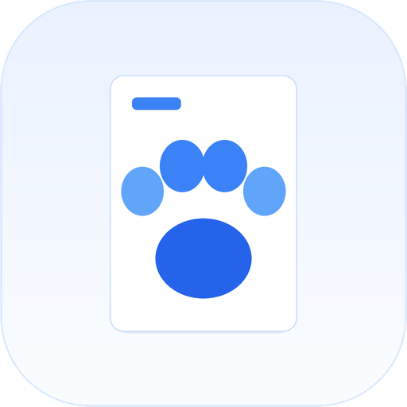
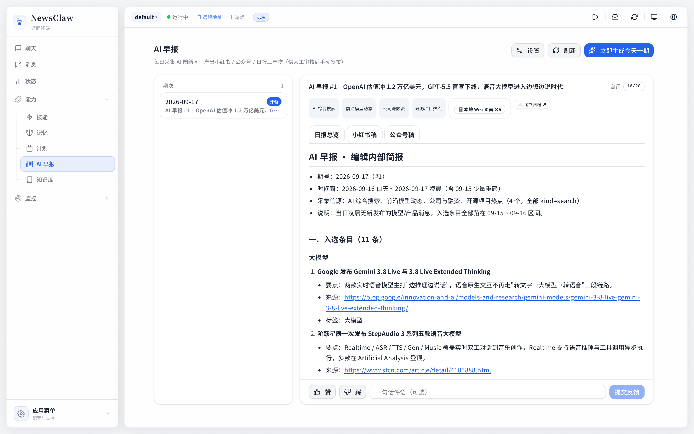
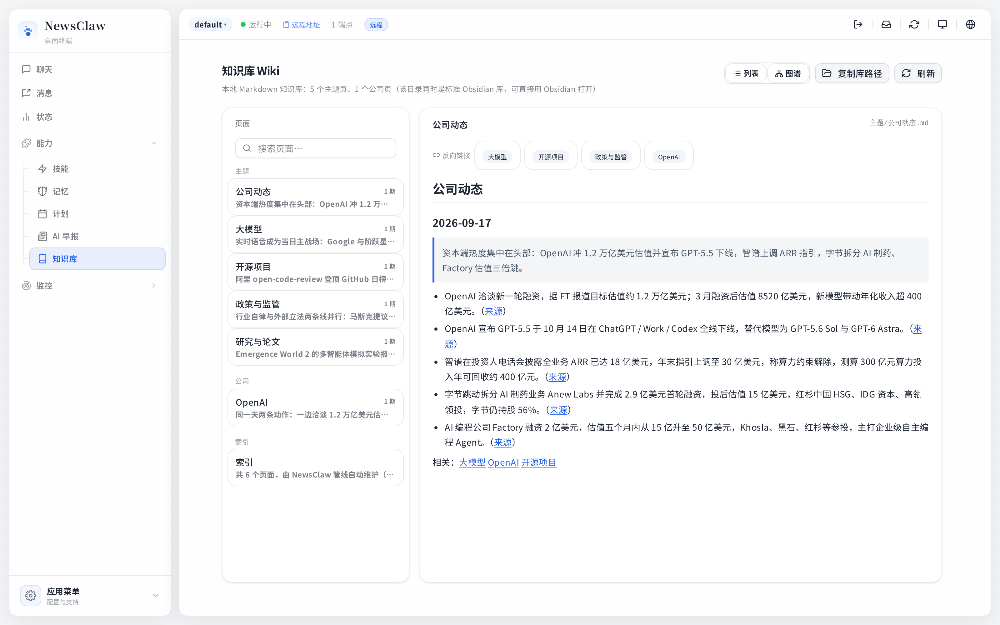
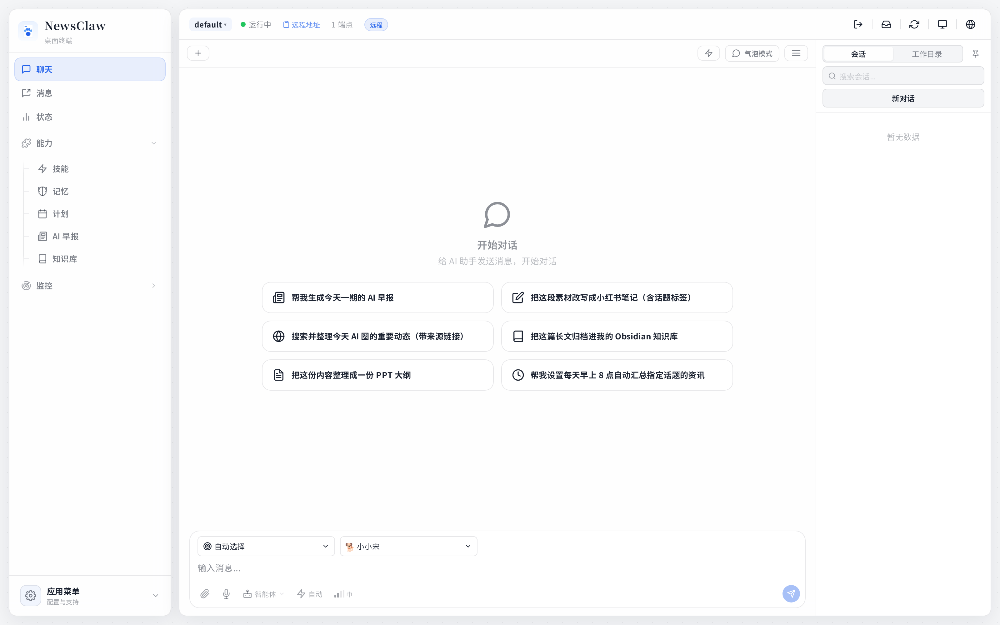
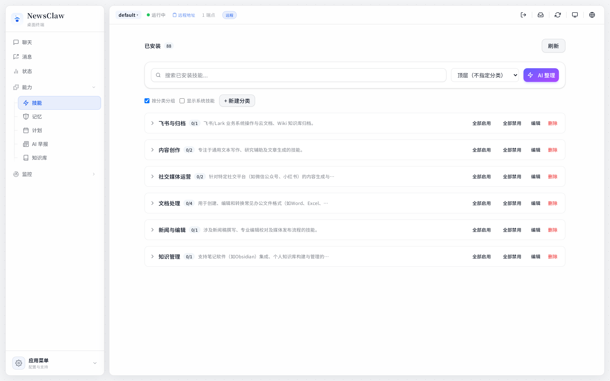
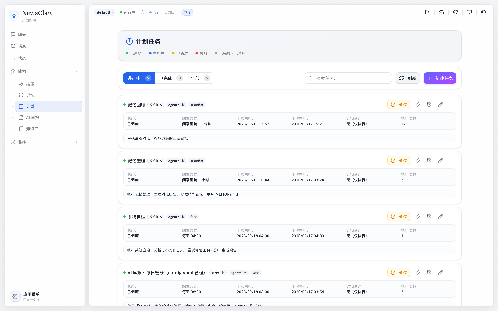
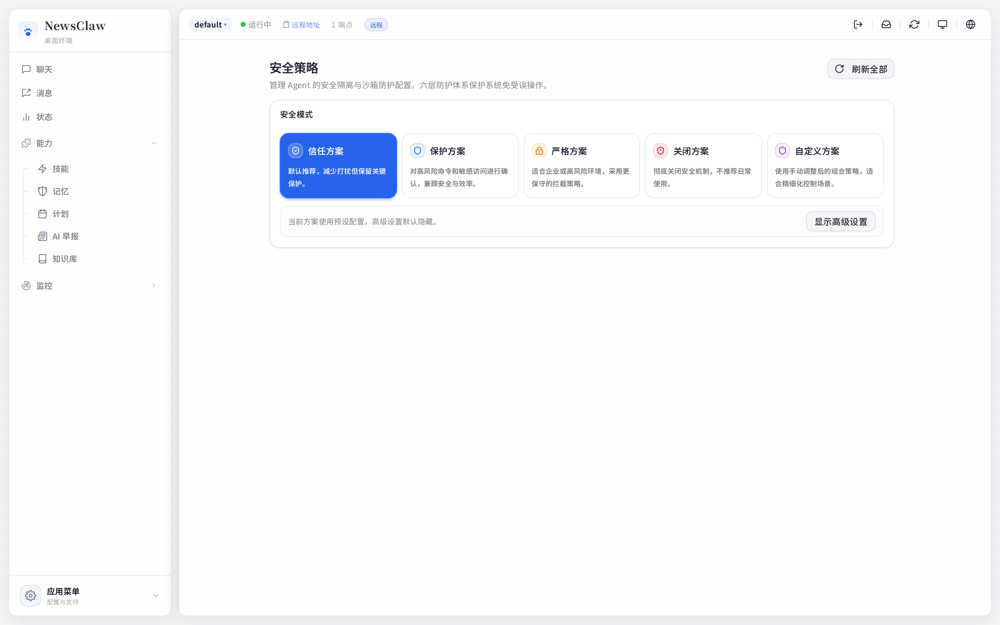
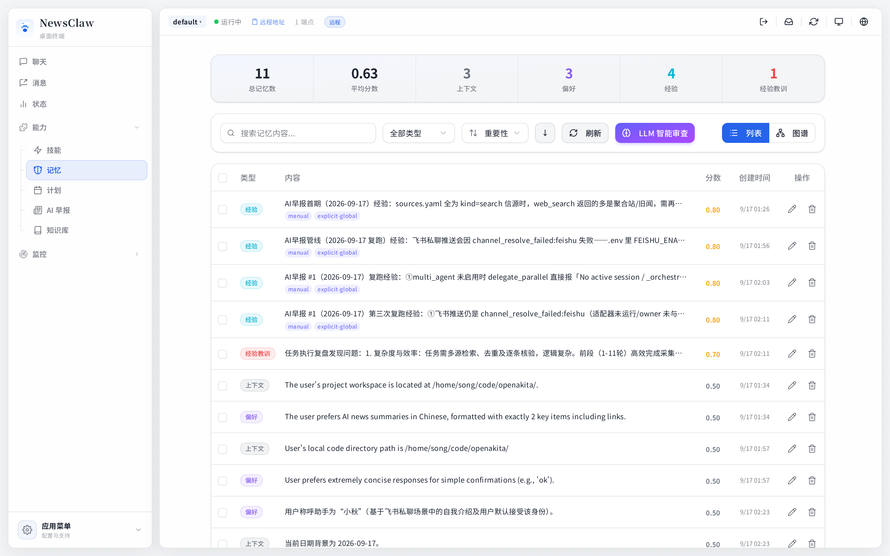
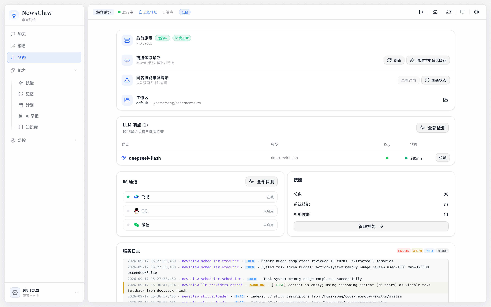

<p align="center">
  
</p>

<h1 align="center">NewsClaw</h1>

<p align="center">
  <b>A daily AI briefing pipeline that rewrites itself</b><br/>
  Collect → draft → archive → review, running as a long-lived background job
</p>

<p align="center">
  
  
  
  
  
  
  
</p>

<p align="center">
  
</p>

> Chinese (primary): [README.md](README.md) · This file is the English edition.

---

**NewsClaw is a local, multi-agent AI assistant with a single main line of work: turning the AI-news firehose into publishable copy.** It does not wait to be asked. A scheduled task collects the day's stories, writes them up, deposits the research into a local knowledge base, archives it to Feishu, and once a week reviews its own output and rewrites its editorial policy.

Everything stays on your machine (`~/.newsclaw` plus the workspace `data/`), and models run on your own keys (32 provider presets built in). Desktop, web and mobile clients share one backend.

---

## What it does every day

| | | |
|---|---|---|
| **① Collect** | **② Draft** | **③ Deposit & archive** |
| Four source families (AI search, frontier-model news, funding, open source) fetched concurrently, deduplicated, scored, then narrowed to 10+ items. | One agent produces three deliverables per issue: an internal brief, a WeChat article draft, and a Xiaohongshu post with hashtags and image suggestions. | Research lands in a local Markdown knowledge base (topic/company pages, backlinks, index) and is archived to Feishu cloud docs. |

<p align="center">
  
  <em>Local Markdown knowledge base: browsable and searchable in the app, and a valid Obsidian vault at the same time — one set of files, two professional forms.</em>
</p>

**④ Review (self-evolution).** Every Sunday a review agent reads the last seven issues' scores and your per-issue feedback, then edits three things: `sources.yaml` (source quality), `editorial-policy.md` (topic taste, voice, structure templates) and memory (rules and experience). The next day's pipeline picks the changes up — that is where "self-evolving" actually lands.

```yaml
# data/newsroom/config.yaml (field names match the code)
enabled: true
daily_cron: "0 8 * * *"      # daily pipeline, local timezone
review_cron: "0 20 * * 0"    # Sunday 20:00 review
# obsidian_vault: ""         # empty = skip Wiki; set an absolute vault path to write
```

---

## Architecture

```
                 ┌──────────────────── Desktop / Web / Mobile clients ────────────────────┐
                 │  React 18 + Tauri 2    newsroom · wiki · chat · skills · schedule · approvals
                 └───────────────────────────────┬────────────────────────────────────────┘
                                                 │  REST / WebSocket
┌────────────────────────────────────────────────▼────────────────────────────────────────┐
│                                  FastAPI (HTTP + event stream)                          │
│                                                                                         │
│   scheduler ──► agent runtime ──► tools → contract writes ──► REST API ──► clients      │
│   cron tasks     ReAct loop       134 tools   Markdown/SQLite                           │
│        │              │                                                                 │
│        │              ├── policy matrix (Policy V2): allow / confirm / deny             │
│        │              │   — unattended runs deny confirmations instead of hanging        │
│        ▼              ▼                                                                 │
│   newsroom line   wiki KB       memory (3 layers)  skills (88)   IM channels (8)        │
└─────────────────────────────────────────────────────────────────────────────────────────┘
```

Python owns **contracts and scheduling** (issue layout, manifest validation, task seeding, feedback storage, REST API); *how* to collect, write and revise is left to the agent's ReAct loop plus editable config, skill and memory files. That boundary is deliberate: behaviour only changes if files can change it, which is what gives the weekly review something to act on.

---

## Capabilities

<table>
<tr>
<td width="50%"><br/><b>Chat</b> — multi-agent delegation, parallel subtasks, plan mode, interrupt & degrade</td>
<td width="50%"><br/><b>Skills</b> — declarative SKILL.md with progressive disclosure; 11 curated + 77 system skills</td>
</tr>
<tr>
<td width="50%"><br/><b>Scheduling</b> — long-lived cron tasks; the pipeline and the review both live here</td>
<td width="50%"><br/><b>Security</b> — policy matrix, path immunity, approval queue, deny-by-default when unattended</td>
</tr>
<tr>
<td width="50%"><br/><b>Memory</b> — three layers with vector retrieval; remembers your preferences across sessions</td>
<td width="50%"><br/><b>Observability</b> — health checks, token stats, diagnostic export, feedback loop</td>
</tr>
</table>

---

## Stack

| | |
|---|---|
| **Backend** | Python 3.11+ · FastAPI · asyncio · aiosqlite · pydantic v2 |
| **Frontend** | React 18 · TypeScript · Vite 6 · Tailwind |
| **Desktop** | Tauri 2 (Rust shell with its own Python runtime bootstrap) |
| **Storage** | SQLite (sessions / memory / audit) + Markdown (wiki / memory / issue artifacts) |
| **Models** | 32 provider presets (Anthropic / OpenAI-compatible / regional / local ollama) |
| **Scale** | 134 tool definitions · 88 skills · 8 IM adapters · 37 frontend views |

```
src/newsclaw/
  newsroom/      briefing line: issue contract · sources · config · prompts · seeding · feedback
  wiki/          local Markdown knowledge base (topic/company pages, backlinks, index)
  integrations/  Feishu OAuth + document archival · marketplace installer
  core/          agent runtime · Ralph loop · ReasoningEngine · Policy V2
  agents/        multi-agent: orchestration · factory · presets · packaging
  tools/         tool system (handlers / definitions) and search key pools
  prompt/        layered prompt assembly (identity → persona → runtime → rules → catalogs → memory)
  memory/        three-layer memory (storage / vectors / retrieval)
  skills/        skill loading · registry · marketplace · i18n
  scheduler/     cron tasks        channels/  IM adapters       api/  REST + WebSocket
apps/setup-center/   desktop + web frontend (Tauri + React)
skills/              77 system skills + 11 curated external skills
identity/            agent identity (SOUL / AGENT / POLICIES / personas)
tests/               5900+ tests (unit / component / integration / e2e)
```

---

## Quick start

```bash
# Backend
python -m venv .venv && source .venv/bin/activate   # Windows: .venv\Scripts\activate
pip install -e ".[dev]"

newsclaw init                 # setup wizard: model keys, IM channels
newsclaw                      # interactive terminal session
newsclaw run "summarise today's AI news"    # single task; unattended CONFIRM defaults to deny
newsclaw serve                # service mode: IM channels + HTTP API (127.0.0.1:18900)

# Desktop
cd apps/setup-center && npm install && npm run tauri dev
```

## Quality

```bash
pytest                                  # full suite
pytest tests/unit                       # unit only
ruff check src/                         # lint
python -m build --wheel                 # packaging (also validates the skill list against the packaging list)
```

CI runs lint, tests, the wheel build and a frontend type check; green is the bar for a change.

---

## License

**AGPL-3.0-only** — see [LICENSE](LICENSE). Do not relicense to MIT or strip LICENSE / NOTICE / TRADEMARK / copyright lines.

This project is an **unofficial fork** of [OpenAkita](https://github.com/openakita/openakita) (also AGPL-3.0-only). Product positioning, feature scope and code were reworked here; **upstream copyright, licence and attribution notices are preserved as required**: see [NOTICE](NOTICE), [THIRD_PARTY_NOTICES.md](THIRD_PARTY_NOTICES.md), [identity/CREDITS.md](identity/CREDITS.md) and [TRADEMARK.md](TRADEMARK.md).

There is **no standalone NewsClaw cloud** and no official account / marketplace hostname. `NEWSCLAW_ACCOUNT_MODE` defaults to `disabled`; account or marketplace integrations need an explicit URL. The plugin UI SDK (`openakita_plugin_sdk`, upstream PyPI name kept so existing plugins keep importing) is a **separate MIT-licensed** companion: plugin authors may ship call-site code under MIT, but running it inside this repository remains bound by the host AGPL-3.0-only.

## What is not in this repository

To keep the main line readable, the following are deliberately not published here (the local development copy keeps them; see `.gitignore`): upstream's sample and media plugin sets, the archive of skills moved off the main line, internal revamp plans and the release pipeline (signed installers, store packages, container images — all needing private credentials), and upstream's product documentation site.
